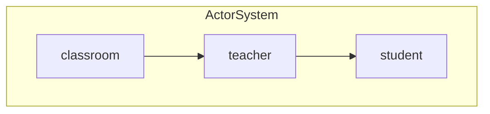
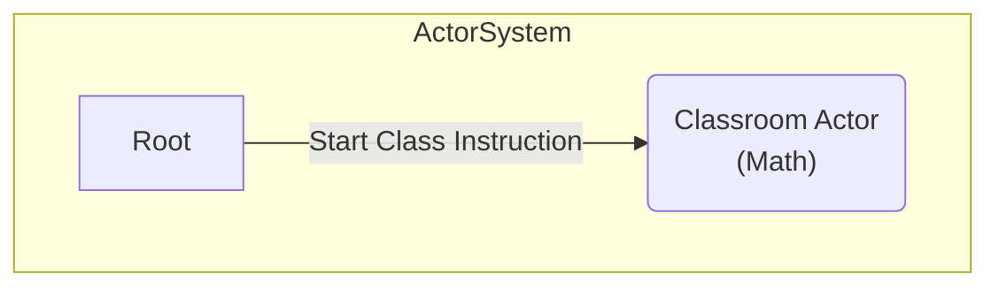
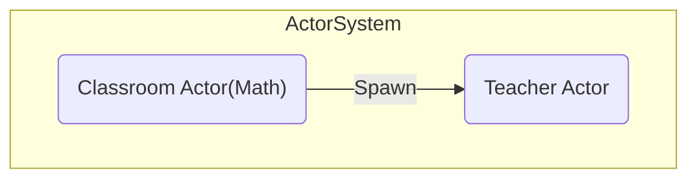
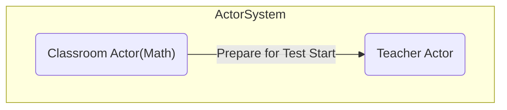
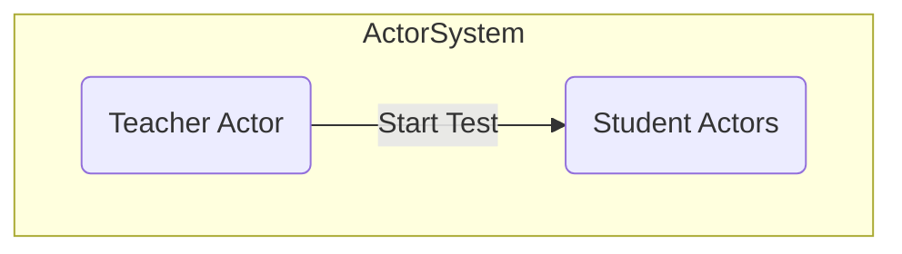
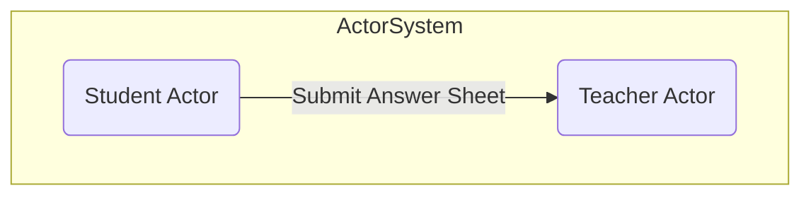
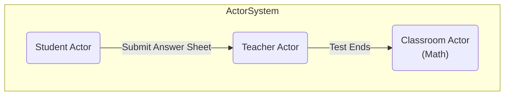
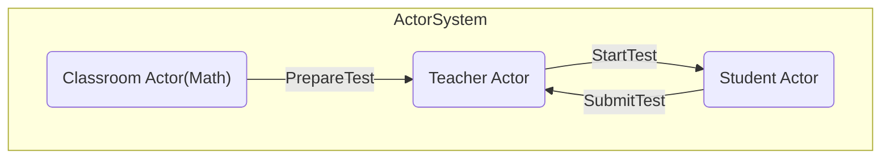
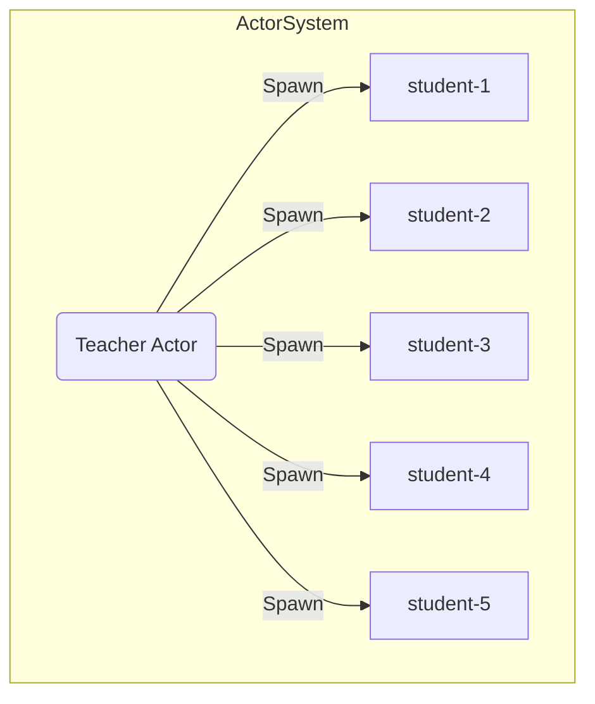

# phpcon okinawa 2024 Phluxor Examples

Training the Actor Model with Phluxor.

Although this is quite different from typical PHP processing,

it is a good way to learn about the actor model.

All actors in the actor model are executed asynchronously via coroutines.

No special middleware is used.  
100% PHP (with Swoole) is used to implement the actor model.

日本語向けの解説はProto Actor(Go)をベースにした解説になっていますが、  
下記で解説していますので、参考にしてください。  
基本的な概念や構造、メソッドのインターフェースもほぼ同じように提供しています。

[日本語記事はこちら](https://blog.ytake.jp.net/entry/2024/02/22/090000).

## Class Room Example

The flow of actor creation is as follows.



The hierarchy would be as follows.

- Classroom / top level actor
    - Teacher / aggregate actor & child actor
        - Students(20) / child actor

We will represent the following classroom activities in school life using the actor model:

- Class time begins
- The teacher comes to the classroom
- Test begins
- Write your answers on the answer sheet
- Submit test answer sheets
- After everyone has submitted, the class ends

### Class time begins



### The teacher comes to the classroom

In this example,  
"The teacher is coming" is expressed as a classroom actor creating a teacher actor.



### Test begins

The Classroom Actor Sends a Message to the Teacher Actor to Prepare for the Test Start



### Write your answers on the answer sheet



### Submit test answer sheets



### After everyone has submitted, the class ends



## Implementation

The actual message passing between actors is as follows.



generate multiple student actors as follows:



## Setup

```bash
$ docker compose up -d 
$ docker compose exec phluxor composer install
```

### Actor Model Easy Example

```bash
$ docker compose exec phluxor php main.php
```

### Classroom, Teacher, Student Example

```bash
$ docker compose exec phluxor php classroom.php
```
